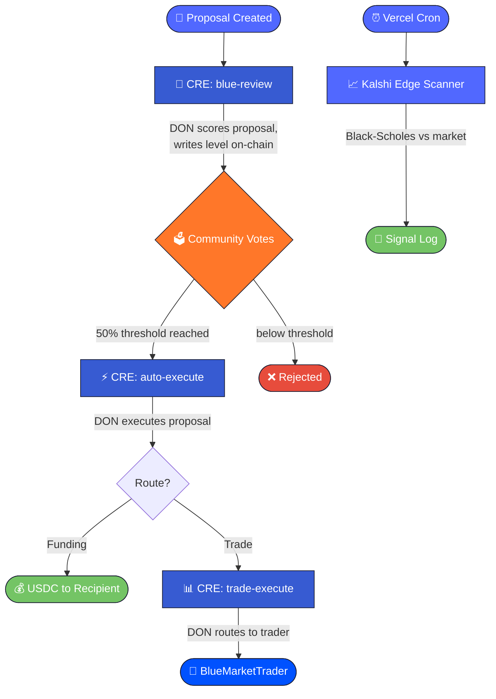

<div align="center">


# Mental Wealth Academy

**Decentralized Education, Micro-University For Humans & Machines Evolving Through Collectively Owned Cyberspace.**

[](https://nextjs.org/)
[](https://soliditylang.org/)
[](https://chain.link/)
[](https://base.org/)

</div>

---

## What this is

Mental Wealth Academy is a research cohort and learning app. Members complete quests, Blue reviews the work, and approved submissions can earn USDC rewards from a bounded community treasury.

Governance controls the community spending path. The larger reserve stays behind a Safe/Gnosis multisig, while the app-facing micro-treasury handles smaller quest rewards, grants, and approved proposals.

```text
// large-treasury: the main reserve. Protected by the 2-of-3 Safe/Gnosis multisig; used for custody, reserves, and high-risk transfers.
// micro-treasury: the smaller app-facing USDC pool. Governance can route funds here for quests, grants, and approved proposals.
// quests + USDC rewards: members submit proof of work, Blue reviews it, and approved claims can receive USDC from the micro-treasury.
```

**Governance contract:** [`0x09a4FEfEe8245B644713546FDF28b4160218f7Fc`](https://basescan.org/address/0x09a4FEfEe8245B644713546FDF28b4160218f7Fc) (BlueKillStreak, Base Mainnet)

---


https://github.com/user-attachments/assets/e111f509-1f39-4009-8c8e-b8beef6165a0


## What's advanced here

### `/community`

The community governance hub. Members submit funding proposals, vote on-chain, and interact with **Blue** -- the AI governance agent reviewing the micro-treasury spending path.

- **Private Governance Calls** -- Blue reviews every proposal through the ElizaOS API, scoring across 6 dimensions (clarity, impact, feasibility, budget, ingenuity, chaos). Reviews are delivered on-chain via CRE workflow DON, making AI scoring tamper-proof.
- **On-chain Voting** -- Token-weighted community votes with a 50% threshold. Blue's approval level (1-4) determines her voting weight (10%-40%). Level 0 kills the proposal outright.
- **Quest and USDC Rewards** -- Approved quest work and community proposals can route USDC from the micro-treasury. The large-treasury remains separate multisig custody.

### `/markets`

A live edge-detection dashboard scanning **Kalshi**, the CFTC-regulated US prediction market exchange.

- **Black-Scholes Binary Pricer** -- Compares Kalshi market prices against a short-dated Black-Scholes model fed by live CoinGecko spot. Edges over 3% become signals.
- **Quarter-Kelly Sizing** -- Conservative position sizing caps notional at 5% of the trading treasury per position, 40% total exposure.
- **Live Orderbooks** -- Curated Kalshi markets across commodities, economics, AI, and politics, sorted by balance, volume, and end-date proximity.
- **Dry-Run Signals** -- Order placement is intentionally not wired. Signals are emitted to the execution log for review; nothing routes capital without explicit approval.
- **Governance Path** -- Trade proposals can also flow through community governance on `/community`, giving the DAO direct input on trading decisions.

---

## CRE Integration

Three CRE workflows run in the Chainlink DON, automating governance review and execution:

### 1. `blue-review` -- AI Proposal Scoring
**Trigger:** `ProposalCreated` event on-chain

When a proposal is submitted, this workflow reads the proposal from the contract, calls the Eliza AI API for scoring across 6 dimensions (clarity, impact, feasibility, budget, ingenuity, chaos), computes an approval level (0-4), and writes the review back on-chain via a DON-signed report (`actionType 2`).

Blue's level determines her voting weight: Level 1 = 10%, Level 2 = 20%, Level 3 = 30%, Level 4 = 40%. Level 0 kills the proposal outright. Because the AI scoring runs inside the DON, no single server can fake scores.

### 2. `auto-execute` -- Proposal Execution
**Trigger:** Cron (every 10 minutes)

Scans all active proposals. When one has reached the 50% vote threshold, it submits a DON-signed report (`actionType 1`) to execute the proposal on-chain, transferring USDC to the recipient.

### 3. `trade-execute` -- Governance-Triggered Trading
**Trigger:** `ProposalExecuted` event on-chain

When a trade proposal passes governance and the recipient is the trader contract, this workflow infers trade direction from the proposal text and submits a DON-signed report to `BlueMarketTrader.onReport()`, routing the trading treasury's USDC into a prediction market position.

> The autonomous market scanner is a Vercel cron, not a CRE workflow. CRE is reserved for governance paths where DON signatures gate on-chain state changes.

### Pipeline



---

## Smart Contracts

| Contract | Purpose |
|----------|---------|
| **BlueKillStreak** | Governance: proposals, token-weighted voting, CRE `onReport()` receiver (actionType 1 = auto-execute, 2 = AI review). All reports DON-signed via KeystoneForwarder. |
| **BlueMarketTrader** | Separate trading treasury: owner and CRE-triggered trades on prediction markets. Own `onReport()` receiver, `deposit()`/`withdraw()` for treasury management. |
| **MockPredictionMarket** | Binary outcome market accepting USDC -- mock target for trade execution testing. |
| **EtherealHorizonPathway** | 14-milestone on-chain seal system for the 12-week educational pathway. |

### Tests

```bash
cd contracts && forge test
# 70 tests pass: 31 governance, 23 market trader, 16 pathway
```

Key test coverage:
- AI review at all levels (0-4), including CRE-delivered reviews
- Community voting with snapshot-based anti-manipulation
- Trader contract: buy YES/NO, CRE onReport, deposit/withdraw, insufficient balance
- Mock prediction market position tracking
- Revert conditions: unauthorized, below threshold, no market set, zero amount

---

## Tech Stack

| Layer | Technology |
|-------|-----------|
| **Contracts** | Solidity 0.8.24, Foundry, Base Mainnet |
| **Automation** | Chainlink CRE (3 governance workflows), KeystoneForwarder |
| **Markets** | Kalshi public API, CoinGecko spot prices |
| **AI Agent** | Blue via Eliza Cloud API (reviews), Anthropic Claude (chat) |
| **Frontend** | Next.js 14, TypeScript |
| **Wallet** | Coinbase SDK |

---

## Project Structure

```
contracts/
  src/
    BlueKillStreak.sol         -- Governance + CRE receiver
    BlueMarketTrader.sol       -- Trading treasury + CRE receiver
    MockPredictionMarket.sol    -- Trade target for testing
    EtherealHorizonPathway.sol  -- Educational milestones
  test/
    BlueKillStreak.t.sol       -- 31 governance tests
    BlueMarketTrader.t.sol     -- 23 trader tests
    EtherealHorizonPathway.t.sol

cre-workflows/
  blue-review/         -- Event-triggered AI scoring
  auto-execute/        -- Cron-based proposal execution
  trade-execute/       -- Event-triggered governance trade routing
  shared/
    abi.ts             -- Governance contract ABI fragments
    trader-abi.ts      -- Trader contract ABI fragments
```

---

## Running Locally

```bash
# Frontend
npm install && npm run dev

# Contracts
cd contracts && forge build && forge test

# CRE workflows (simulate)
cd cre-workflows
cre workflow simulate --workflow blue-review
cre workflow simulate --workflow auto-execute
```
