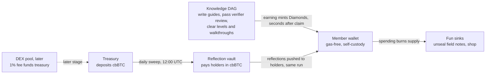

<div align="center">

# Mental Wealth Academy

[](https://nextjs.org/)
[](https://soliditylang.org/)
[](https://base.org/)

An interactive archive of knowledge built on psychology, with blockchain-based ownership, accompanied by Blue.

</div>

---

## Contribute to the knowledge DAG, earn Diamonds, accumulate Bitcoin

The heart of the Academy is a knowledge base structured as a directed acyclic graph: one definitive, verified guide per topic, each unlocking the guides above it. Contributing to that graph is the main way members earn Diamonds ($BLUE) — and holding Diamonds accumulates Bitcoin reflections, paid in cbBTC on a daily clock.



**Contributing to the DAG pays at every altitude:**

| Contribution | Diamonds |
| :--- | ---: |
| Complete a guide | 50 |
| Clear a level (every guide beneath it) | 150 |
| Finish a full walkthrough | 500 + a free spin |

Guides live in an acyclic prerequisite graph — level N+1 stays locked until every level-N guide beneath it is cleared — and each guide is reviewed by an odd-numbered verifier jury drawn from members who passed the verifier test for that subject. Authors draft in the Guide Studio, which shows exactly where a draft will sit in the skill tree before it ships.

Every Diamond interaction is onchain: earning mints straight to the member's wallet through a sponsored relayer (no gas, no signature), and spending is a real burn verified server-side before anything unseals.

---

## Bitcoin reflections: the split rule and the clock

Hold at least 1,000 BLUE in your own wallet and every treasury deposit pays you cbBTC, pro-rata:

```
your payout = deposit × your BLUE ÷ eligible BLUE
```

There is no fixed rate per Diamond — the per-Diamond figure moves with the deposit size and the eligible supply. The first live drop on Base Sepolia (July 7, 2026) ran the rule with real transactions:

| Metric | First live drop |
| :--- | ---: |
| Deposit | 0.02 cbBTC |
| Eligible supply | 9,500 BLUE |
| Per BLUE held | 210.5 sats |
| Per 1,000 BLUE (eligibility floor) | 0.00210526 cbBTC |
| Share of every drop, per BLUE | 0.0105% |

**Timing, stage by stage:**

| Stage | Clock |
| :--- | ---: |
| Earning mints land in the wallet | seconds after claim |
| Treasury deposit into the vault | daily, 12:00 UTC |
| Accrual to holders | instant at the deposit block |
| Payout pushed to wallets | under a minute later |
| Longest wait to a first payout | 24 hours |
| Self-serve `claim()` | anytime |

Blue's 200M stash and DEX pairs are excluded from reflections — yield belongs to members. The DEX pool is a deliberate later stage: the trade fee is already set at 1% with the treasury as recipient, hard-capped at 2% in the contract, and rides the same daily pipeline once a pair is flagged.

---

## Contracts

| Component | Base Mainnet | Base Sepolia (testnet) |
| :--- | :--- | :--- |
| Diamonds ($BLUE) | `0x4A25Cea1f05C6725dC90849FBaafF00d67342B3f` | `0xd116e780ca9ec3984e7682e095aab50006a9c160` |
| Reflection vault | deploying with V2 | `0xc8FfD11F157C71F58477Cc49a2bf25bc69683b20` |
| Reward token (cbBTC) | native cbBTC | `0x71a92f9b94646e5119f82cd7b01c69da8ec3a352` (mock) |
| Blue's agent wallet | `0x0920553CcA188871b146ee79f562B4Af46aB4f8a` | same wallet, both chains |

**Trust rails, compiled in and unchangeable:**

- Fee capped at 2% as a compile-time constant, with no admin override
- Renouncing ownership permanently ends minting for everyone
- Blue's 200M stash is excluded from reflection dividends
- Payouts are onchain transfers anyone can audit

---

## What this is

Mental Wealth Academy is a gamified educational gameworld built on behavioral psychology, with blockchain-backed ownership of what you earn, accompanied by Blue — the AI companion who reviews, rewards, and keeps the record.

Knowledge is structured in ascending levels, so you level up instead of grinding through tutorial hell. Each level cleared kills learning fatigue and pays out like a quest — you always know the next rung, and you always know why you're on it.

---

## Built with GPT-5.6

OpenAI's GPT-5.6 Sol was used to build this project: designing and writing application code across the Next.js app, the Solidity contracts, and the agent-based social simulation in `simulation-backend/`, alongside shaping Blue's character and the knowledge DAG's reward and verification logic. It was a development collaborator throughout the build rather than a runtime dependency of the deployed app.

---

## Running locally

```bash
npm install && npm run dev
cd contracts && forge build && forge test
```

Set `NEXT_PUBLIC_USE_TESTNET=true` in `.env.local` to route Diamonds flows to Base Sepolia for integration testing. Useful scripts:

```bash
npx tsx --env-file=.env.local scripts/e2e-reflections-sepolia.ts   # full reflections rehearsal
npx tsx --env-file=.env.local scripts/verify-diamond-ledger.ts     # prove ledger rows match the chain
npx tsx scripts/faucet-blue-sepolia.ts                             # top up Blue's Sepolia gas
```

---

## Where this fits

Open infrastructure for open-sourced knowledge, tools, and collective intelligence. No single company controls it; it belongs to the network.

## Get involved

Docs → docs.mentalwealthacademy.world
Email → research@mentalwealthacademy.net

Open protocol · Community governed · Apache-2.0 · © 2026
