# Financial Blockchain Map

This map is derived from contracts, deployment broadcasts, API routes, and financial integration libraries in this repository. It describes coded or committed configuration paths, not current balances or a guarantee that each deployed integration is operational. Database-only gems/shards are excluded because they are not blockchain assets or treasury pools.

## System Map

```mermaid
flowchart TB
    classDef actor fill:#ecf4ff,stroke:#2864c8,color:#102348;
    classDef control fill:#fff3d6,stroke:#bf811d,color:#402904;
    classDef pool fill:#ddf5e6,stroke:#23824c,color:#102f1c;
    classDef asset fill:#eff1f4,stroke:#5a6878,color:#17202b;
    classDef external fill:#f0e9fc,stroke:#7551b5,color:#261846;
    classDef mock fill:#fde7da,stroke:#c45728,color:#442113;
    classDef warning fill:#ffe2e1,stroke:#c52d35,color:#4b1014;
    classDef dormant fill:#f1f1f1,stroke:#888,color:#333,stroke-dasharray: 5 4;

    subgraph PEOPLE["Authority and eligibility"]
        SAFEOWN["Safe owners<br/>James + Blue + AI<br/>2 of 3 signatures"]:::actor
        BLUEEOA["Blue signer / agent EOA<br/>0x0920...4f8a<br/>BLUE_PRIVATE_KEY path"]:::actor
        BLUECDP["Blue CDP wallet<br/>Coinbase SDK wallet ID/seed path<br/>not proven equal to Blue EOA"]:::actor
        HOLDERS["MWG holders<br/>self-delegate + vote"]:::actor
        VIP["VIP ERC-1155 holders<br/>staff and live-Kalshi gate"]:::actor
        ANGELS["Academic Angel ERC-721 holders<br/>quest payout eligibility"]:::actor
        ADMIN["Server ADMIN_SECRET holder"]:::actor
    end

    subgraph BASE["Base Mainnet - chain ID 8453"]
        USDC["USDC<br/>0x833589...A02913"]:::asset
        SAFE[["Documented large reserve custody<br/>Safe 0xbD2A...fC71"]]:::control
        MWG["BlueCreditSystem / MWG ERC20Votes<br/>0x0Eb595...A28E7<br/>minting finalized in V2 broadcast"]:::asset
        GOV[["Governance USDC pool / micro-treasury<br/>BlueKillStreak 0x09a4...f7Fc"]]:::pool
        TRADER[["On-chain trading USDC pool<br/>BlueMarketTrader 0xAFa538...fd92"]]:::pool
        MOCK[["MockPredictionMarket<br/>demo YES/NO USDC positions<br/>not a live exchange"]]:::mock
        OPWALLET[["Operational USDC / ETH balance<br/>held by Blue CDP wallet"]]:::pool
        VIPNFT["VIP Membership Card ERC-1155<br/>0x5da790...d6fc, token ID 1"]:::asset
        ANGELNFT["Academic Angels ERC-721<br/>address supplied by config"]:::asset
        APPLE["APPLE ERC-20<br/>fallback 0xE8a48d...1FB07"]:::asset
        UNIPOOL[["Uniswap V3 APPLE / USDC pool<br/>APPLE_UNISWAP_POOL configured externally"]]:::pool
        PATHWAY["EtherealHorizonPathway<br/>0xd116e7...9c160<br/>seal state only; no asset transfer"]:::dormant
    end

    subgraph GOVERNANCE["Governance and CRE automation"]
        PROPOSER["Proposal recipient / proposer"]:::actor
        REVIEW["CRE blue-review"]:::external
        AUTO["CRE auto-execute"]:::external
        TRADEWF["CRE trade-execute"]:::external
        FORWARDER["Chainlink KeystoneForwarder<br/>plus pinned workflow owner/name"]:::external
        DRIFT["Committed CRE drift<br/>review + auto target legacy 0x2cbb...<br/>trade traderAddress is zero"]:::warning
    end

    subgraph APPLEFLOW["APPLE distribution rail"]
        CLANKER["Clanker deployment API"]:::external
        DISTRIBUTE["Admin distribution route<br/>80% verified epoch profit paid<br/>20% retained; capped"]:::control
        APPLEHOLDERS["Eligible APPLE holders"]:::actor
    end

    subgraph PAYMENTS["Membership, rewards, and paid research"]
        BUYER["Membership buyer"]:::actor
        FINALIZE["Proposal finalization route<br/>CDP governance-token transfer path"]:::control
        QUEST["Quest USDC claim<br/>staff approved"]:::control
        RECIPIENT["Quest reward recipient"]:::actor
        X402["x402 paid research client<br/>library present; no caller found"]:::dormant
    end

    subgraph MARKET["External market desk - not an EVM pool"]
        DATA["Kalshi public market data<br/>+ CoinGecko spot prices"]:::external
        SCANNER["Edge scanner / sizing engine<br/>cron path logs signals only"]:::control
        LIVE["VIP-gated live order endpoint<br/>server RSA credentials"]:::control
        KALSHI[["Kalshi account and orders<br/>external custody / funding rail"]]:::external
    end

    SAFEOWN -->|approves Safe transactions| SAFE
    BLUEEOA -->|one Safe signer| SAFEOWN
    SAFE -->|Ownable control| MWG
    SAFE -->|admin, emergency withdraw, CRE configuration| GOV
    SAFE -->|market/CRE configuration, claim, refund, withdraw| TRADER

    MWG -->|snapshot voting power| GOV
    MWG -->|V2 snapshot: 40,000 MWG| BLUEEOA
    HOLDERS <-->|hold and delegate| MWG
    HOLDERS -->|create proposal and vote| GOV
    BLUEEOA -->|agent direct review fallback| GOV
    MWG -. token selected through configuration .-> FINALIZE
    BLUECDP -->|allocateTokens signer| FINALIZE
    FINALIZE -->|MWG reward transfer after DB approval| PROPOSER

    USDC -->|funding| GOV
    USDC -->|deposit or direct funding| TRADER
    GOV -->|approved USDC payout| PROPOSER
    GOV -->|recipient can be trader| TRADER
    TRADER -->|buyOutcome with USDC, if market configured| MOCK
    MOCK -->|claim or unresolved refund| TRADER
    TRADER -->|owner withdrawal| SAFE

    GOV -. ProposalCreated .-> REVIEW
    REVIEW -->|DON-signed review| FORWARDER
    AUTO -->|DON-signed execution| FORWARDER
    FORWARDER -->|onReport action 1 or 2| GOV
    GOV -. ProposalExecuted to trader .-> TRADEWF
    TRADEWF -->|DON-signed trade instruction| FORWARDER
    FORWARDER -->|onReport trade| TRADER
    DRIFT -. currently prevents interpreting these as V2 live wiring .-> REVIEW
    DRIFT -. currently prevents interpreting these as V2 live wiring .-> TRADEWF

    BLUECDP -->|holds / spends USDC| OPWALLET
    ANGELNFT -->|ownership check| ANGELS
    VIPNFT -->|ownership check| VIP
    ANGELS -->|may submit eligible claim| QUEST
    VIP -->|staff approval gate| QUEST
    OPWALLET -->|blueWallet.distributeUSDC| QUEST
    QUEST -->|USDC payment| RECIPIENT

    ADMIN -->|deploy trigger| CLANKER
    BLUECDP -->|token admin, rewards recipient, 3% vault recipient| CLANKER
    CLANKER -->|creates token paired with USDC| APPLE
    APPLE --- UNIPOOL
    USDC --- UNIPOOL
    APPLE -->|holder snapshot| DISTRIBUTE
    ADMIN -->|distribution trigger| DISTRIBUTE
    OPWALLET -->|USDC source| DISTRIBUTE
    DISTRIBUTE -->|pro-rata USDC| APPLEHOLDERS

    BUYER -->|USDC or ETH membership payment| BLUEEOA
    BLUEEOA -->|ERC-1155 inventory transfer after verification| BUYER
    VIPNFT -. inventory and ownership record .-> BLUEEOA
    BLUEEOA -. signs paid fetch when called .-> X402
    BLUEEOA -->|owner key can seal weeks| PATHWAY

    DATA --> SCANNER
    SCANNER -->|trade plan only| LIVE
    VIP -->|authorize POST /trade/execute| LIVE
    LIVE -->|signed API order| KALSHI
```

## Treasury Pools And Controls

| Pool or value rail | Asset / location | Who can move or affect value | Implemented destination |
| --- | --- | --- | --- |
| Documented large reserve | Safe `0xbD2A...fC71` | Two of three Safe owners | The README states reserve custody; the app does not aggregate this balance. The Safe also owns the V2 token, governance contract, and trader in broadcast records. |
| Governance micro-treasury | USDC held by `BlueKillStreak` `0x09a4...f7Fc` | MWG holders vote; Blue/CRE sets initial review weight; 50% approval executes; Safe can emergency-withdraw and configure CRE/admins | USDC to a proposal recipient, including potentially `BlueMarketTrader`. |
| On-chain trading treasury | USDC held by `BlueMarketTrader` `0xAFa538...fd92` | Safe owner can configure/execute/withdraw/claim/refund; an accepted CRE report can execute a trade; anyone can deposit | `MockPredictionMarket` positions only when a prediction market is configured. |
| Mock prediction-market position pool | USDC held by `MockPredictionMarket` | Trader buys positions; anyone can resolve a mock market; position holder claims/refunds | Returns USDC to the position holder, normally `BlueMarketTrader`. This is a demo rail, not Kalshi. |
| Blue operational payout balance | USDC/ETH in the Coinbase SDK `blueWallet` account | Server CDP wallet credentials; `ADMIN_SECRET` for APPLE distribution; VIP holder approval for quest claims | Quest USDC recipients and APPLE holders. This wallet is not proven in code to be either governed contract pool. |
| MWG proposal allocation rail | Configured governance token balance in the Coinbase SDK `blueWallet` account | A proposal owner finalizes a database-approved review; CDP wallet signs `allocateTokens` | MWG token transfer to the proposal owner, separate from `BlueKillStreak` USDC execution. |
| APPLE liquidity / reward rail | APPLE paired with USDC through Clanker / optional Uniswap V3 pool | `ADMIN_SECRET` starts deploy/distribution; Blue CDP wallet is requested as token admin/rewards/vault recipient | USDC distributions to eligible APPLE holders; 80% distributed and 20% retained subject to caps. |
| Membership sale rail | ETH or USDC paid to Blue private-key wallet; VIP ERC-1155 inventory | Buyer pays; server verifies payment; Blue signer sends NFT | One VIP Membership Card to buyer. VIP ownership gates staff review and live Kalshi ordering. |
| Kalshi execution rail | External Kalshi account, outside Base contracts | Any authenticated VIP-card holder can call the endpoint; server Kalshi RSA credentials sign the order | Live Kalshi orders. No coded movement from `BlueMarketTrader` or a Base USDC pool into Kalshi. |
| x402 research rail | Base EVM payment client using Blue private-key signer | Code path exists in `lib/x402-research.ts`; no importing caller was found | Paid external research resources if integrated later. |

## Networks And Deployed Addresses

| Item | Repository evidence | Address / network |
| --- | --- | --- |
| Production chain used by current financial code | Contracts, market/payment libraries, and broadcasts | Base Mainnet, chain ID `8453` |
| Supported test deployment chain | Deploy scripts and CRE staging project config | Base Sepolia, chain ID `84532` |
| USDC | `DeployV2.s.sol`, payment and market libraries | Base Mainnet `0x833589fCD6eDb6E08f4c7C32D4f71b54bdA02913` |
| V2 MWG voting token | `contracts/broadcast/DeployV2.s.sol/8453/run-latest.json` | `0x0Eb5956b043A3Cd95C0f050a86faff48B7aA28E7` |
| V2 governance micro-treasury | V2 broadcast and current README/app defaults | `0x09a4FEfEe8245B644713546FDF28b4160218f7Fc` |
| V2 on-chain trading treasury | V2 broadcast | `0xAFa5382c8c634021f55Cc680D45209a203bBfd92` |
| Safe owner of V2 contracts | Safe artifact and ownership-transfer broadcast | `0xbD2A2DBaDb71BDaCDB9A51E8d1c33f31B412fC71`, threshold `2-of-3` |
| Blue contract agent / Safe signer | V2 broadcast and Safe artifact | `0x0920553CcA188871b146ee79f562B4Af46aB4f8a` |
| Pathway state contract | Pathway broadcast and app config example | `0xd116e780Ca9Ec3984e7682e095aaB50006A9c160` |
| VIP membership ERC-1155 | Membership library configuration default | `0x5da79055cf8ca6482c997df58822e08e5707d6fc`, token ID `1` |
| APPLE token | Holder-indexer fallback value | `0xE8a48daB9d307d74aBC8657421f8a2803661FB07` |

## Wiring Gaps And Drift

| Issue visible in the repo | Impact on the financial map |
| --- | --- |
| `cre-workflows/blue-review/config.production.json` and `auto-execute/config.production.json` target legacy governance address `0x2cbb...`, while V2 and the app point at `0x09a4...`. | CRE arrows in the diagram show intended behavior; committed production configuration does not target the V2 governance pool. |
| `cre-workflows/trade-execute/config.production.json` has `traderAddress` set to `0x0000000000000000000000000000000000000000`. | Governance-triggered on-chain trading is not configured for the deployed V2 trader in the committed file. |
| No production deployment or committed setter transaction for `MockPredictionMarket` / `BlueMarketTrader.setPredictionMarket` is present in the V2 artifacts. | The on-chain market position rail is implemented and tested, but a live configured counterparty is not evidenced here. |
| The Kalshi VIP endpoint directly places orders with Kalshi credentials, while the on-chain trader only calls `buyOutcome` on a configured EVM market. | Kalshi trading and `BlueMarketTrader` must be treated as separate rails, not a single treasury pool. |
| `lib/pathway-contract.ts` provides an on-chain sealing writer, but current `app/api/ethereal-progress/route.ts` writes seals and shard rewards to the database without calling it. | The pathway contract is blockchain state, but not a current financial-transfer path from the app route. |
| `.env.example` and several scripts retain legacy Azura names and old deployment addresses. | Resolve operational configuration against V2 addresses before using scripts for balances or automation. |

## Primary Sources

| Concern | Source files |
| --- | --- |
| Contract assets, permissions, transfers | `contracts/src/BlueCreditSystem.sol`, `contracts/src/BlueKillStreak.sol`, `contracts/src/BlueMarketTrader.sol`, `contracts/src/MockPredictionMarket.sol`, `contracts/src/EtherealHorizonPathway.sol` |
| Deployment and Safe ownership | `contracts/broadcast/DeployV2.s.sol/8453/run-latest.json`, `contracts/broadcast/TransferOwnership.s.sol/8453/run-latest.json`, `contracts/migration/safe.json` |
| CRE influence path | `cre-workflows/*/main.ts`, `cre-workflows/*/config.production.json` |
| On-chain and Kalshi market rails | `lib/market-api.ts`, `lib/trading-engine.ts`, `lib/kalshi-trading.ts`, `app/api/treasury/trade/execute/route.ts` |
| Operational USDC and APPLE payouts | `lib/blue-wallet.ts`, `lib/clanker-deploy.ts`, `lib/apple-holders.ts`, `app/api/treasury/distribute/route.ts` |
| Membership and quest payouts | `lib/crypto-payment.ts`, `lib/blue-membership.ts`, `lib/vip-membership-card.ts`, `lib/academic-angels.ts`, `app/api/quests/usdc/review/route.ts` |
