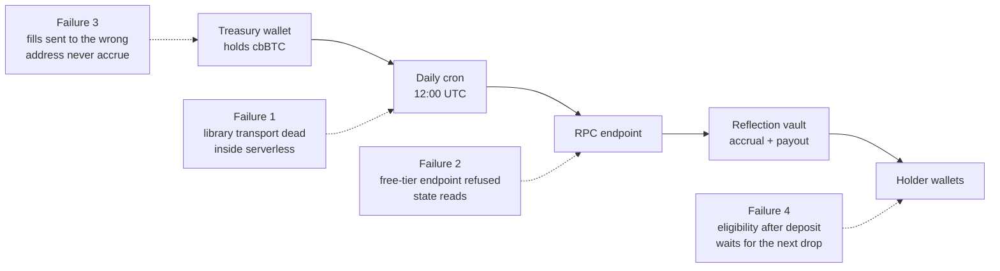

# Testnet hardening: trade-offs and failures, July 2026

Written for investors and stakeholders. During the Base Sepolia rehearsal of Diamonds ($BLUE) and the Bitcoin reflections vault (July 6 to 8, 2026), we ran the full token pipeline with mock funds and deliberately small drops. The rehearsal surfaced four real failures. Every one was found and fixed before a single unit of real value was at stake — which is the point of rehearsing. This document records what broke, what we traded off, and what the system now defends against.

## The pipeline, and where it broke

## Failure 1 — the library could not make a network request

The reflections automation was first built on ethers v5, the older of the two standard Ethereum libraries. Its HTTP transport turned out to be unable to complete any request from inside our hosting provider's serverless functions — against every RPC endpoint, while the platform's native transport worked from the same process. The failure presented as a generic contract error, which cost most of a day of diagnosis before a captured inner error named it.

**Resolution.** The automation now runs on viem, the modern library built on the platform's native transport. It worked on the first attempt after the port.

**Trade-off.** The codebase carries both libraries during the transition. Remaining server paths on the old library are scheduled for the same port; until then they are treated as suspect. The lesson we institutionalized: transport-level failures masquerade as contract failures, so every diagnosis starts by separating the two.

## Failure 2 — the free-tier RPC endpoint

Blockchain infrastructure is metered. Our free-tier Alchemy endpoint exhibited two distinct problems: load-balanced replicas that lag behind the chain (reads briefly disagree with confirmed transactions, which also poisons gas estimation), and a request profile consistent with an app-level contract allowlist — calls touching the Diamonds token passed while calls to the reward token were refused, and cheap methods sailed through, which made the endpoint look healthy to naive checks.

**Resolution.** Server code no longer trusts any configured endpoint. Before every treasury write, a resolver probes the exact operation class the pipeline needs (a real state read against the least-privileged contract we touch) and falls through an ordered list of public endpoints until one passes. Transactions carry explicit nonces and pinned gas so stale replicas cannot double-spend a nonce or starve a payout loop.

**Trade-off.** Free tiers are genuinely free and fine for development, and public endpoints are rate-limited but consistent. A paid RPC tier buys higher limits and support, and is budgeted for mainnet. The defense in depth stays either way — a paid endpoint can also misbehave, and the probe costs one call.

## Failure 3 — funding the vault has exactly one correct door

The reflection vault only credits holders through its `depositReflections` function, which snapshots eligible holdings and updates the payout accounting atomically. cbBTC transferred directly to the vault's address bypasses that accounting and strands. A treasury fill during the rehearsal went to the wrong place and produced a morning of "where are the reflections."

**Resolution.** The daily automation is now the only funding path anyone needs: cbBTC sent to the treasury wallet is swept into the vault through the correct door at 12:00 UTC, and payouts push in the same run. The operational rule is one line: fund the treasury wallet, never the vault.

**Trade-off.** A vault that accepted bare transfers would be more forgiving but could not keep the pro-rata accounting atomic and auditable. We chose the strict door and automated the path to it.

## Failure 4 — accrual timing is a feature that reads like a bug

Two test members reached the 1,000 BLUE eligibility floor at 01:02 UTC and expected reflections that morning. The vault snapshots holdings at each deposit: cross the floor after a deposit and you earn from the next one. Both members were paid in full at the next drop, exactly per the formula.

**Resolution.** No code change — the behavior is correct and is what makes every payout auditable against a specific block. What changed is the communication: the published timing table now states the worst case plainly (eligibility to first payout is at most 24 hours).

**Trade-off.** Continuous streaming accrual would remove the wait but costs far more gas and is much harder to verify onchain. A daily drop with block-precise snapshots keeps every satoshi accountable.

## Platform constraints we accepted

The app runs on a zero-ops hosting tier: scheduled jobs fire at most daily, functions cap at 60 seconds, and configuration changes apply only to the next deployment. These fit a daily reflections drop naturally and cost nothing. They are the reason the drop is a clock, not a stream — and the clock turned out to be the better stakeholder story anyway.

## What the rehearsal proved

The economics executed exactly to the published formula on every drop: deposit times holder balance over eligible supply, house excluded, sub-floor wallets excluded, payouts pushed to self-custody wallets within a minute of the deposit. The final rehearsal drop paid two real members 0.00173913 cbBTC each — the predicted number to the last decimal — through the same production route that runs unattended every day at 12:00 UTC.

Four failures, all found with mock funds, all fixed with defenses that stay on for mainnet, and a ledger-versus-chain audit script that proves every recorded mint and burn against real onchain transfers. That is what the testnet was for.
